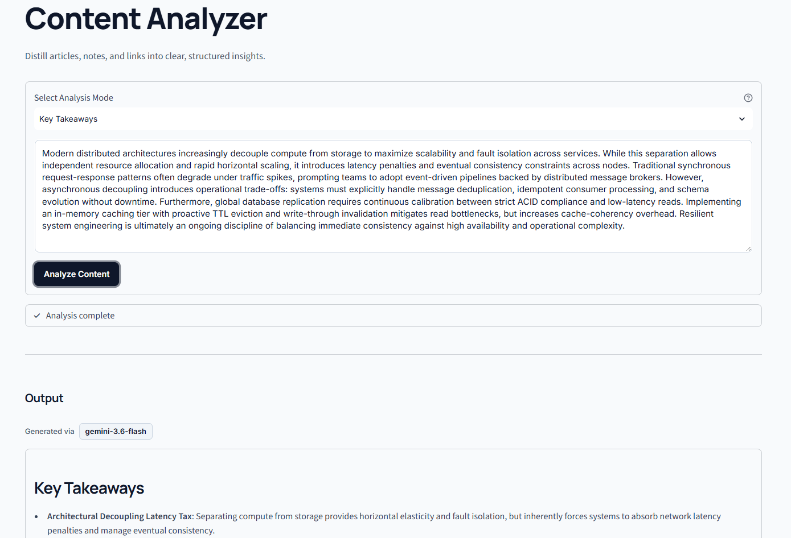

# Content Analyzer

A fast, responsive web application to analyze digital content using large language models. It extracts text from web pages, processes it into structured insights across eight specialized analysis modes, and generates export-ready Markdown and PDF reports.

## Preview



**🔗 [View Live Application](https://jatinp-content-analyzer.streamlit.app/)**

## Core Features

- **Specialized Analysis Modes:** Eight pre-configured analytical frameworks tailored for structured summaries, actionable steps, critical evaluation, educational breakdowns, and targeted communications:
  - **Core Summary:** Synthesizes the central thesis, supporting arguments, and final conclusion into clear sections.
  - **Key Takeaways:** Extracts the highest-leverage insights formatted with concept headlines.
  - **Action Items:** Converts content into prioritized, execution-ready steps starting with imperative action verbs.
  - **Explain Like I'm 5:** Simplifies complex concepts using accessible language and everyday analogies.
  - **Blog Post Outline:** Structures content into a publication-ready narrative arc with section prompts.
  - **Q&A Generator:** Formulates critical questions and concise, text-grounded answers.
  - **Professional Post:** Drafts an insight-driven update suitable for professional networks.
  - **Casual Post:** Creates a natural, conversational message for community discussions and chats.
- **Automated Web Extraction:** Isolates primary text content from web URLs using HTML parsing, stripping away navigation bars, scripts, and advertisements.
- **Direct Text Input:** Supports custom text and markdown input with real-time character counters and input validation.
- **Multi-Format Export:** Instantly export generated analyses as formatted Markdown, plain text, or clean, printable PDF documents with one-click clipboard copying.

## Technical Overview

The application uses a modular pipeline that cleanly separates content extraction, language model orchestration, and document generation. It interfaces directly with the Google GenAI SDK, featuring in-memory model discovery caching and adaptive fallback routing to manage API rate limits and model availability without interruptions. The system is backed by a continuous integration pipeline (GitHub Actions) and an automated test suite with fully mocked external dependencies.

## UI & Design

- **Clean, Focused Design:** A custom CSS theme provides a distraction-free, highly readable reading and editing interface.
- **Fluid Typography:** Responsive typography and layout adjustments ensure comfortable readability across desktop and mobile screens.

## Tech Stack

- **Language:** Python
- **Framework:** Streamlit
- **AI Integration:** Google GenAI SDK (Gemini API)
- **Web Extraction:** Requests, BeautifulSoup4
- **Document Generation:** FPDF2, Markdown
- **Testing & CI:** Pytest, Pytest-Mock, GitHub Actions

## Running it Locally

1. Ensure you have Python installed on your system.

2. Clone the repository:

   ```bash
   git clone https://github.com/jatinpanigrahy/content-analyzer.git
   cd content-analyzer
   ```

3. Activate your virtual environment (e.g., `.venv`):

   ```bash
   python -m venv .venv
   # Windows (PowerShell):
   .\.venv\Scripts\Activate.ps1
   # macOS/Linux:
   source .venv/bin/activate
   ```

4. Install the required dependencies:

   ```bash
   pip install -r requirements.txt
   pip install -r requirements-dev.txt
   ```

5. Set up your environment variables:

   Configure your Google Gemini API key:

   ```bash
   # Windows (PowerShell):
   $env:GEMINI_API_KEY="your_api_key_here"

   # macOS/Linux:
   export GEMINI_API_KEY="your_api_key_here"
   ```

   *(Alternatively, create a `.streamlit/secrets.toml` file containing `GEMINI_API_KEY = "your_api_key_here"`)*

6. Run tests:

   ```bash
   python -m pytest
   ```

7. Launch the application:

   ```bash
   streamlit run app.py
   ```

## Deployment

This application is deployed and hosted via Streamlit Community Cloud.

**Live Application:** <https://jatinp-content-analyzer.streamlit.app/>